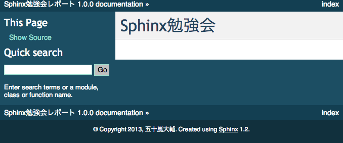

======================================
ハンズオン：勉強会レポートを作成しよう
======================================

では、実際にドキュメントを書いてみましょう。

今回の勉強会メモを作っていきます。

こんなことを書きましょうか
==========================

* 勉強会のタイトル
* 開催情報
* 勉強会の内容
* 資料

sphinx-quickstart
==================
まずは、好きなディレクトリに移動して、sphinx-quickstartを実行します。

.. code-block:: bash

    [env] $ sphinx-quickstart 03
    Welcome to the Sphinx 1.2 quickstart utility.

    Please enter values for the following settings (just press Enter to
    accept a default value, if one is given in brackets).

    Selected root path: 03

    You have two options for placing the build directory for Sphinx output.
    Either, you use a directory "_build" within the root path, or you separate
    "source" and "build" directories within the root path.
    > Separate source and build directories (y/N) [n]:

    Inside the root directory, two more directories will be created; "_templates"
    for custom HTML templates and "_static" for custom stylesheets and other static
    files. You can enter another prefix (such as ".") to replace the underscore.
    > Name prefix for templates and static dir [_]:

    The project name will occur in several places in the built documentation.
    > Project name: Sphinx勉強会レポート
    > Author name(s): 五十嵐大輔

    Sphinx has the notion of a "version" and a "release" for the
    software. Each version can have multiple releases. For example, for
    Python the version is something like 2.5 or 3.0, while the release is
    something like 2.5.1 or 3.0a1.  If you don't need this dual structure,
    just set both to the same value.
    > Project version: 1.0.0
    > Project release [1.0.0]:

    The file name suffix for source files. Commonly, this is either ".txt"
    or ".rst".  Only files with this suffix are considered documents.
    > Source file suffix [.rst]:

    One document is special in that it is considered the top node of the
    "contents tree", that is, it is the root of the hierarchical structure
    of the documents. Normally, this is "index", but if your "index"
    document is a custom template, you can also set this to another filename.
    > Name of your master document (without suffix) [index]:

    Sphinx can also add configuration for epub output:
    > Do you want to use the epub builder (y/N) [n]:

    Please indicate if you want to use one of the following Sphinx extensions:
    > autodoc: automatically insert docstrings from modules (y/N) [n]:
    > doctest: automatically test code snippets in doctest blocks (y/N) [n]:
    > intersphinx: link between Sphinx documentation of different projects (y/N) [n]:
    > todo: write "todo" entries that can be shown or hidden on build (y/N) [n]:
    > coverage: checks for documentation coverage (y/N) [n]:
    > pngmath: include math, rendered as PNG images (y/N) [n]:
    > mathjax: include math, rendered in the browser by MathJax (y/N) [n]:
    > ifconfig: conditional inclusion of content based on config values (y/N) [n]:
    > viewcode: include links to the source code of documented Python objects (y/N) [n]:

    A Makefile and a Windows command file can be generated for you so that you
    only have to run e.g. `make html' instead of invoking sphinx-build
    directly.
    > Create Makefile? (Y/n) [y]:
    )
    > Create Windows command file? (Y/n) [y]:

    Creating file 03/conf.py.
    Creating file 03/index.rst.
    Creating file 03/Makefile.
    Creating file 03/make.bat.

    Finished: An initial directory structure has been created.

    You should now populate your master file 03/index.rst and create other documentation
    source files. Use the Makefile to build the docs, like so:
    make builder
    where "builder" is one of the supported builders, e.g. html, latex or linkcheck.

今回は、index.rstの中身は必要ないので、一旦全て削除します。

まずはタイトル
==============
まずは勉強会のタイトルを書きます。

.. code-block:: rst

    ============
    Sphinx勉強会
    ============

文字の上下に文字列と同じ長さの記号を書くと、*セクション* になります。

文字の下に文字列と同じ長さの記号を書いても同じです。

１つのファイルの中で一番最初にでてくるセクションがページのタイトルになります。

index.rstを編集したら保存して、make htmlでビルドしてみましょう。

.. code-block:: bash

    $ make html
    sphinx-build -b html -d _build/doctrees   . _build/html
    Making output directory...
    Running Sphinx v1.2
    loading pickled environment... not yet created
    building [html]: targets for 1 source files that are out of date
    updating environment: 1 added, 0 changed, 0 removed
    reading sources... [100%] index
    looking for now-outdated files... none found
    pickling environment... done
    checking consistency... done
    preparing documents... done
    writing output... [100%] index
    writing additional files... genindex search
    copying static files... done
    copying extra files... dumping search index... done
    dumping object inventory... done
    build succeeded.

    Build finished. The HTML pages are in _build/html.

ビルドが完了したら _build/html/index.html を開きます。

.. code-block:: bash

    $ open _build/html/index.html

以下のようになっていれば成功です。

続いて、各セクションを作成します。
==================================

::

    ============
    Sphinx勉強会
    ============
    
    開催情報
    ========

    勉強会の内容
    ============

    資料
    ====

各セクションの文字列の下に、-や=で線を引きます。これでセクションを作ることができます。

セクションは全部で６レベル分作ることができ、
出現した順番にレベル分けされます。

セクション名に使用できる記号はたくさんありますが、見やすさから::

    = - ` : . ' " ~ ^ _ * + #

これらが推奨されているようです。

参加者と日時
============
次に、開催情報に参加者と日時を箇条書きを使って追加しましょう。

::

    開催情報
    ========
    * 日時： 2013/12/21 13:00-17:00
    * 場所： CoCoDe
    * 参加者： planset, ...

* + -とスペースを１つ入れてから文章を書くとリストになります。

ビルドすると、<ul><li>に変換されます。

番号付きリストも使うことができ、::

    1. 項目1
    2. 項目2
    3. 項目3

というように書いてビルドすると<ol><li>に変換されます。

番号付きリストは1.,2.,3.以外にも、(1),(2),(3)...や1),2),3)やA.,B.,C.でも書けます。

また、#.を使うことで自動で番号をふることもできます。

勉強会の内容　段落、引用文
==========================
長い文章を書いている場合、段落として区切りたい場合がでてきます。
その場合には、空行を１つ入れて下さい。それだけで段落となります。

::

    勉強会の内容
    ============
    Spihnxは、reStructuredText記法で書かれたテキストファイルをHTML、PDFやepubなどに変換するためのツールです。

    Pythonの公式ドキュメントはSphinxを使って書かれています。
    また、Python以外の多くのプロジェクトでもSphinxが利用されています。

次に、引用を書きます。

行頭にひとつ以上のスペースを入れて文章を書くことで引用文として<blockquote>に変換されます。

::

    資料から引用します。

        Spihnxは、reStructuredText記法で書かれたテキストファイルをHTML、PDFやepubなどに変換するためのツールです。

        Pythonの公式ドキュメントはSphinxを使って書かれています。
        また、Python以外の多くのプロジェクトでもSphinxが利用されています。

    というわけでSphinxってすごそうです。

行頭にいれたスペースが同じ数であれば、同じ引用の業として解釈されます。

リスト、サブリスト
===================
先ほど箇条書きを書きましたが、サブリストもよく書きたくなります。

勉強会の内容に以下を追加しましょう::

    sphinxを利用するために必要なこと

    * テキストエディタ 
    * python環境

      * python
      * (pip)
      * (virtualenv)
      * sphinx
    
    * コマンドラインツールへの多少の慣れ
    

サブリストを書くときは、１行開けます。

次に、トップレベルのリストの文章を書いているところを先頭として、
行頭にスペースを入れてリストを書いていきます。

強調
====
文章を書くとき、強調したい文章があると思います。

強調を行うには、以下のようにします。

======== =========== ============ =========
         使用例      書き方       HTMLタグ
======== =========== ============ =========
強調     *文字列*    \*で囲む     <em>
強い強調 **文字列**  \*\*で囲む   <strong>
======== =========== ============ =========

先ほどのリストを強調してみます。::

    sphinxを利用するために必要なこと

    * テキスト*エディタ*
    * *python* 環境

      * *python*
      * (pip)
      * (virtualenv)
      * **sphinx**
    
    * コマンドラインツールへの多少の慣れ
    

前後に文字が続く場合には、\*の前または後ろにスペースを入れる必要があります。

資料　リンク
============
文章を書いていると、外部へのリンクを作りたい場合があります。

次のようにリンクを書くことができます。::

    資料
    ====

    * http://sphinx-doc.org/
    * `github <https://github.com>`_
    * Sphinx-users.jp_

    .. _Sphinx-users.jp: http://sphinx-users.jp/

1. 普通にURLを書くと自動でリンクになる。
2. 文字列_ または `スペースを 含む文字列`_ と書いておいて、
   あとから \.\. \_`スペースを 含む文字列`: URL とするとリンクになる。
3. `文字列 <URL>`_ とするとリンクになる。

.. _`スペースを 含む文字列`: http://localhost/

どの方法が良いというわけはありません。

3の方法は同じ文言を同じリンクにしたい場合には
有効ですが、文字列と実際のリンクURLが離れてしまう欠点もあります。

逆に、2の方法で、同じ文字列に対して2回書いてしまうと、ビルド時に警告がでます。

コメント
========
行頭に .. をつけるとコメントになります。

::

    .. あーつかれた

複数のファイルを扱う。
=======================
いまindex.rstに作っていってもらいましたが、これが複数になってくると、
ファイルを分けて書きたくなります。

次はファイルを分けて管理してみましょう。

次のようなファイル構成を考えます。::

    sample/
     |- index.rst
     |- report/
         |- 20131221_study_sphinx.rst
         |- 20131222_study_sphinx2.rst
         |- ・
         |- ・

この場合どうやってsphinxでビルドするか見て行きましょう。

ファイルをリネームする。
========================
まず、今までのindex.rstをリネームして、20131221_study_sphinx.rstにします。
長い場合には、もっと短くてもよいです。

ついでにそのファイルをコピーして、20131222_study_sphinx2.rstも作りましょう。

ディレクトリを作成する。
========================
reportディレクトリを作りって先ほどの２つのファイルを入れます。::

    mkdir report
    mv 2013* report/

index.rstを作成
===============
次のようなindex.rstを作りましょう。

.. code-block:: rst

    サンプルドキュメント
    ====================

    Contents:

    .. toctree::
        :maxdepth: 2
        :numbered:
        :glob: 

        report/*

    Indices and tables
    ==================

    * :ref:`genindex`
    * :ref:`modindex`
    * :ref:`search`

